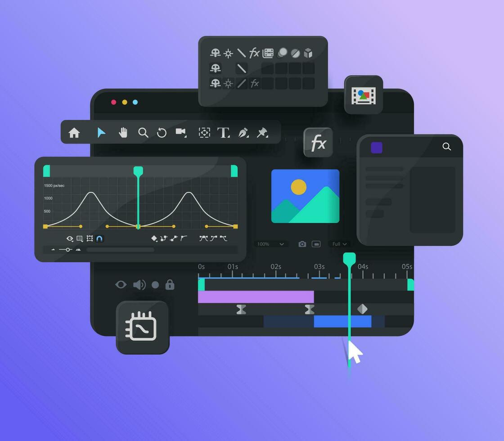

# Framester

[![Contributors][contributors-shield]][contributors-url]
[![Forks][forks-shield]][forks-url]
[![Stargazers][stars-shield]][stars-url]
[![Issues][issues-shield]][issues-url]
[![MIT License][license-shield]][license-url]
[![LinkedIn][linkedin-shield]][linkedin-url]

<!-- PROJECT LOGO -->


## About The Project

NOTE: This README is still work in progress, stay tuned. 😬
<!-- ABOUT THE PROJECT --
[![Product Name Screen Shot][product-screenshot]](https://example.com)

There are many great README templates available on GitHub; however, I didn't find one that really suited my needs so I created this enhanced one. I want to create a README template so amazing that it'll be the last one you ever need -- I think this is it.

Here's why:

- Your time should be focused on creating something amazing. A project that solves a problem and helps others
- You shouldn't be doing the same tasks over and over like creating a README from scratch
- You should implement DRY principles to the rest of your life :smile:

Of course, no one template will serve all projects since your needs may be different. So I'll be adding more in the near future. You may also suggest changes by forking this repo and creating a pull request or opening an issue. Thanks to all the people have contributed to expanding this template!

Use the `BLANK_README.md` to get started.
-->
### Built With

  

### Supported OS


<!-- GETTING STARTED -->
## Getting Started

Clone the repository in your local machine.

NOTE: We will provide trained models soon.

### Prerequisites

Please make sure that you have:

1. Python3 programming Language
2.  GPU (We tested with RTX 3070 Notebook GPU)
3. CUDA with appropriate cuDNN installed

### Installation

1. Get a free API Key at [https://example.com](https://example.com)
2. Clone the _main_ branch

   ```sh
   git clone https://github.com/mohitgupta3/Framester.git
   ```

3. Install Python packages

   ```sh
   pip3 install -r requirements.txt
   ```

4. Run the `Gradio` app

   ```sh
   gradio app.py
   ```
<!--
<!-- USAGE EXAMPLES --

## Usage

Use this space to show useful examples of how a project can be used. Additional screenshots, code examples and demos work well in this space. You may also link to more resources.

_For more examples, please refer to the [Documentation](https://example.com)_

<!-- ROADMAP --

## Roadmap

- [x] Add Changelog
- [x] Add back to top links
- [ ] Add Additional Templates w/ Examples
- [ ] Add "components" document to easily copy & paste sections of the readme
- [ ] Multi-language Support
  - [ ] Chinese
  - [ ] Spanish

See the [open issues](https://github.com/mohitgupta3/Framester/issues) for a full list of proposed features (and known issues).

<!-- CONTRIBUTING --

## Contributing

Contributions are what make the open source community such an amazing place to learn, inspire, and create. Any contributions you make are **greatly appreciated**.

If you have a suggestion that would make this better, please fork the repo and create a pull request. You can also simply open an issue with the tag "enhancement".
Don't forget to give the project a star! Thanks again!

1. Fork the Project
2. Create your Feature Branch (`git checkout -b feature/AmazingFeature`)
3. Commit your Changes (`git commit -m 'Add some AmazingFeature'`)
4. Push to the Branch (`git push origin feature/AmazingFeature`)
5. Open a Pull Request

<!-- LICENSE --

## License

Distributed under the MIT License. See `LICENSE.txt` for more information.

<!-- CONTACT --

## Contact

Your Name - [@your_twitter](https://twitter.com/your_username) - <email@example.com>

Project Link: [https://github.com/your_username/repo_name](https://github.com/your_username/repo_name)
-->
<!-- MARKDOWN LINKS & IMAGES -->
[contributors-shield]: https://img.shields.io/github/contributors/mohitgupta3/Framester.svg?style=for-the-badge
[contributors-url]: https://github.com/mohitgupta3/Framester/graphs/contributors
[forks-shield]: https://img.shields.io/github/forks/mohitgupta3/Framester.svg?style=for-the-badge
[forks-url]: https://github.com/mohitgupta3/Framester/network/members
[stars-shield]: https://img.shields.io/github/stars/mohitgupta3/Framester.svg?style=for-the-badge
[stars-url]: https://github.com/mohitgupta3/Framester/stargazers
[issues-shield]: https://img.shields.io/github/issues/mohitgupta3/Framester.svg?style=for-the-badge
[issues-url]: https://github.com/mohitgupta3/Framester/issues
[license-shield]: https://img.shields.io/github/license/mohitgupta3/Framester.svg?style=for-the-badge
[license-url]: https://github.com/mohitgupta3/Framester/blob/master/LICENSE.txt
[linkedin-shield]: https://img.shields.io/badge/-LinkedIn-black.svg?style=for-the-badge&logo=linkedin&colorB=555
[linkedin-url]: https://linkedin.com/in/othneildrew
